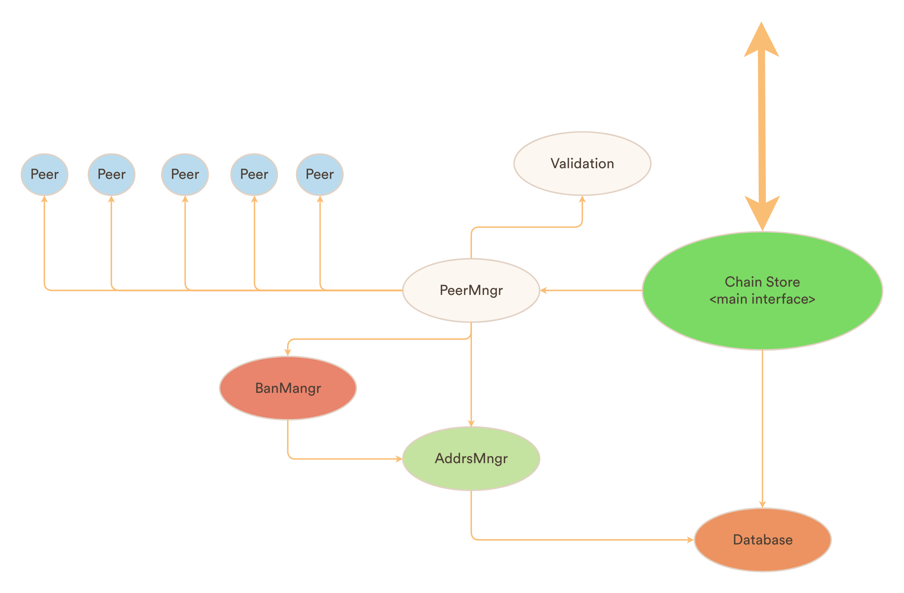
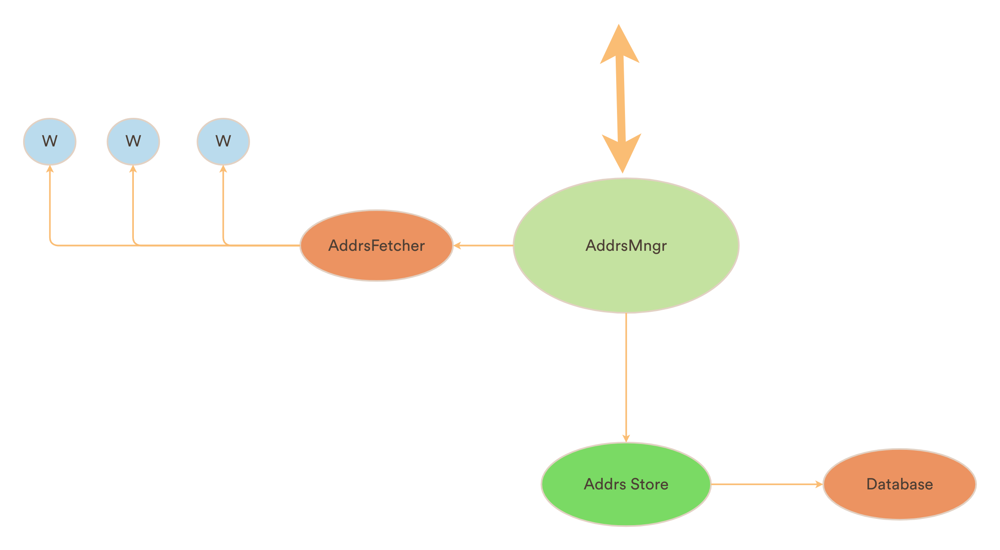

## CBF Node Architecture and Sketch of Next steps forward

### A Basic Node
As per the discussion, in order to handle multiple peers, we need to rearrange the existing sync logic. The goal is to create an easy to follow structure for the the peer CBF message handling and validation logic. As well as make the whole thing testable without connecting to real networks.

A rough sketch of the initial idea for the node's architecture is as below.

In order to test the `PeerManager` we need to simulate mock `Peer` structures that can feed in network data to the manager.

## AddressManager
A similar, but simpler structure will be needed for `AddressManager` also. As below.

Here, each `W` represents a "worker" whose job is to connect to the given peer address and ask for all it's known addresses. So the `AddressManager` is essentially a network crawler.

Just like the `PeerManager` to test it we need mock "workers" that can feed data back to manager, instead of connecting to real network.

In essence the resulting mocking strategy for both `AddressManager` and `PeerManager` would be same.

### Reference
For reference we want to use the [neutrino](https://github.com/lightninglabs/neutrino) project and use their architectures and many node policies, which is possibly the only in-production implementation of BIP157 out there.

## Steps Ahead

In order to systematically reach to the final structure, we can progressively use many existing structs of bdk's CBF module and rearrange them.

Following is a rough steps that we can take to reach to a minimal viable prototype.

 - Make a mocking frameowrk for the `AddressManager`. The address management business logics should hit in the tests.

  - Write a basic `validation` logic inside `PeerManager`.
  - Make the `PeerManager` connect to two hard coded CBF serving nodes and run the outputs through validation logic.
  - Use the same strategy as `AddressManager` to mock the `PeerManager` for two parallel nodes and simulate various edge case, like reorgs, wrong filter data, peer disconnection etc.

   - Fit in the `PeerManager` into existing `Sync` logic.

At this stage the basic idea should be working and testable. Below are future improvements after we reach the basic prototype stage.

 - Simplify the `Store` and remove `rocksdb`. BDK wanted to remove `rocksdb` from CBF ([bdk-issue-link](https://github.com/bitcoindevkit/bdk/issues/480)). That can lead to possible simplification of the `Store` structure too. Possible alternative is sqlite which is more simple and suitable for mobile environment.

  - Add More Peer variety and maintain good list of peers in address database. Deploy some form of ranking strategy.
 - Don't ban peers permanently as there can be probabilistic network error.
 - Maintain top 100 filter data in memory for quick access.
  - Handle parallel request processing, to speed up initial sync.
  - Finish up all other pending features in this [bdk-issue](https://github.com/bitcoindevkit/bdk/issues/81)
